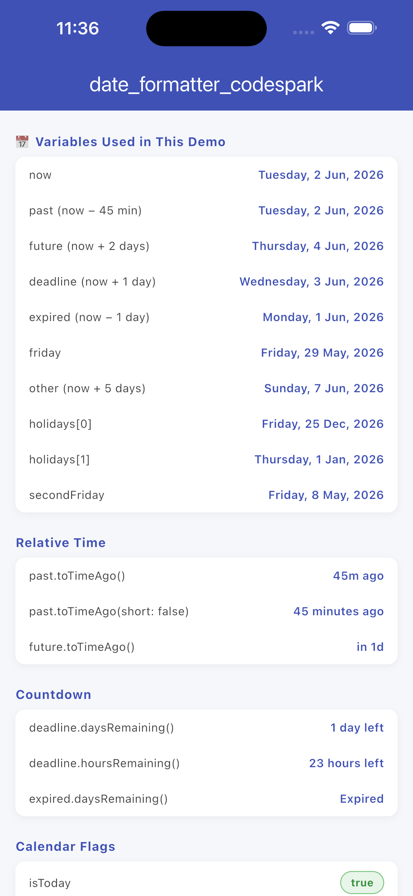
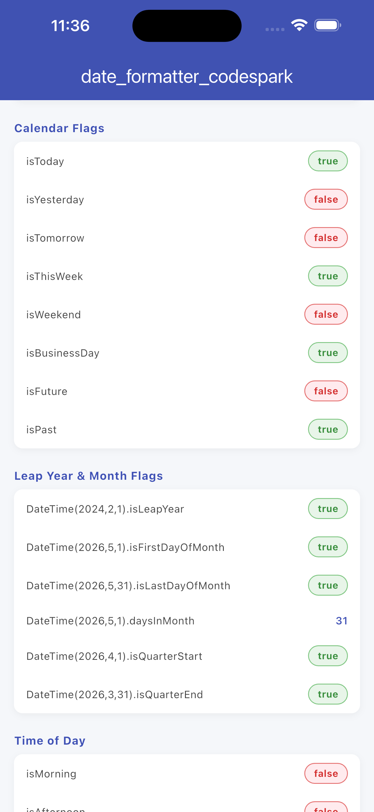
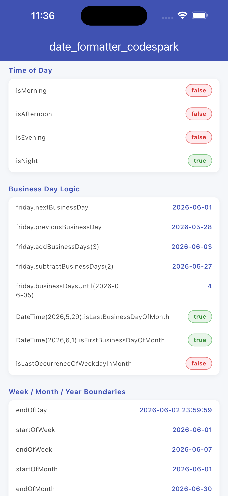
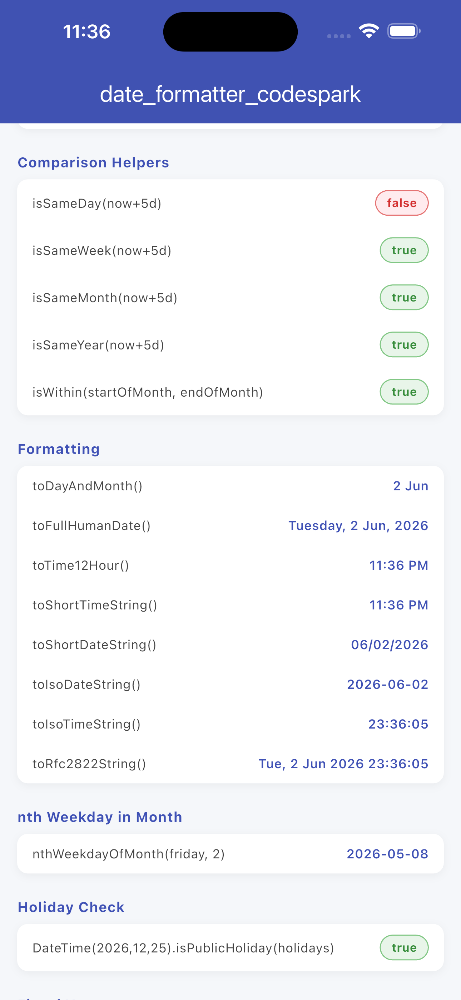
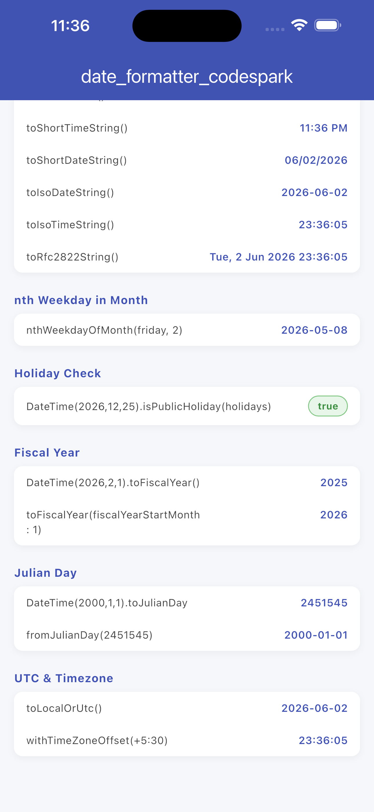

# date_formatter_codespark

A zero-dependency, ultra-lightweight date formatter and DateTime extension package for Dart and Flutter.

Format dates, format DateTime values, generate human-readable dates, create relative timestamps ("5m ago"), display time ago strings, perform business day calculations, and work with weeks, months, quarters, and years through a clean, fluent API.

Perfect as a lightweight alternative to intl for date formatting and a replacement for timeago when displaying relative time and human-readable timestamps.

<p align="center">
  Built by <a href="https://ksaikiran.dev">Katayath Sai Kiran</a> · <a href="https://github.com/Katayath-Sai-Kiran">@Katayath-Sai-Kiran</a>
</p>

<p align="center">
  <a href="https://pub.dev/packages/date_formatter_codespark"></a>
  <a href="https://pub.dev/packages/date_formatter_codespark/score"></a>
  <a href="https://pub.dev/packages/date_formatter_codespark"></a>
  <a href="LICENSE"></a>
  <a href="https://flutter.dev"></a>
  <a href="https://pub.dev/packages/date_formatter_codespark"></a>
</p>


## Screenshots

| | | |
| :---: | :---: | :---: |
|  <br> **Variables & Relative Time** |  <br> **Calendar Flags** |  <br> **Business Day Logic** |
|  <br> **Date Math & Formatting** |  <br> **Holiday, Fiscal & Julian Day** | *(Coming Soon)* |


| **Perfect For**            | **Common Use Cases**          |
| -------------------------- | ----------------------------- |
| Formatting dates           | Date formatting               |
| Formatting DateTime values | DateTime formatting           |
| Time ago displays          | Time ago formatting           |
| Relative timestamps        | Relative timestamp formatting |
| Human-readable dates       | Human-readable timestamps     |
| Chat applications          | Chat message timestamps       |
| Social feeds               | Activity feed timestamps      |
| Activity timelines         | Notification timestamps       |
| Notifications              | Calendar applications         |
| Logs and analytics         | Business day calculations     |
|                            | Date utilities                |
|                            | Date extension utilities      |


### Date Formatter Example

```dart
final now = DateTime.now();

now.toFullHumanDate();   // Friday, 29 May, 2026
now.toIsoDateString();   // 2026-05-29
now.toShortDateString(); // 05/29/2026
```

## The Token-Saving Advantage (Before vs. After)

### 1. Relative Human Time

**Without this package (30 lines of error-prone math):**
```dart
String timeAgo(DateTime date) {
  final diff = DateTime.now().difference(date);
  if (diff.inMinutes < 60) return '${diff.inMinutes}m ago';
  if (diff.inHours < 24) return '${diff.inHours}h ago';
  return '${diff.inDays}d ago';
}
```

**With this package (1 line):**
```dart
dateTime.toTimeAgo(); // "5m ago"
```

### 2. Live Countdown Tracking

**Without this package:** Manual epoch calculations checking for midnight boundaries.

**With this package:**
```dart
dueDate.daysRemaining(); // "3 days left"
```

---


## Key Features & Usage


### Semantic Evaluation Flags
```dart
dateTime.isToday;        // true/false
dateTime.isYesterday;    // true/false
dateTime.isTomorrow;     // true/false
dateTime.isThisWeek;     // true/false
dateTime.isWeekend;      // true/false
dateTime.isBusinessDay;  // true/false
dateTime.isLastBusinessDayOfMonth; // true/false
dateTime.isLeapYear;     // true/false
dateTime.isFuture;       // true/false
dateTime.isPast;         // true/false
```

### Date Formatting & DateTime Formatter Presets

```dart
dateTime.toDayAndMonth();     // "29 May"
dateTime.toTime12Hour();      // "11:30 PM"
dateTime.toFullHumanDate();   // "Friday, 29 May, 2026"
dateTime.toIsoDateString();   // "2026-05-29"
dateTime.toIsoTimeString();   // "09:05:07"
dateTime.toShortTimeString(); // "9:05 AM"
dateTime.toShortDateString(); // "05/30/2026"
dateTime.toRfc2822String();   // "Sat, 30 May 2026 09:05:00 +0000"
```

### Relative Time & Time Ago Formatting
```dart
dateTime.toTimeAgo();               // "12m ago"  (short, default)
dateTime.toTimeAgo(short: false);   // "12 minutes ago"  (verbose)

// Future dates work natively:
dateTime.toTimeAgo(); // "in 3h"
dateTime.toTimeAgo(short: false); // "in 3 hours"
```

### Precise Time Countdowns
```dart
dateTime.daysRemaining();  // "3 days left" | "1 day left" | "Today" | "Expired"
dateTime.hoursRemaining(); // "5 hours left" | "1 hour left" | "Expired"
```

### Business Day & Calendar Math
```dart
dateTime.addBusinessDays(3);      // Skips weekends
dateTime.subtractBusinessDays(2); // Skips weekends
dateTime.nextDay;                 // Next calendar day
dateTime.previousDay;             // Previous calendar day
dateTime.copyWith(year: 2027);    // Clone with changes
```

### Week, Month, Quarter, Year Utilities
```dart
dateTime.weekOfYear;        // ISO week number
dateTime.quarter;           // 1-4
dateTime.isQuarterStart;    // true/false
dateTime.isQuarterEnd;      // true/false
dateTime.startOfWeek;       // Monday
dateTime.endOfWeek;         // Sunday
dateTime.startOfMonth;      // First day
dateTime.endOfMonth;        // Last day
dateTime.startOfYear;       // Jan 1
dateTime.endOfYear;         // Dec 31
dateTime.isFirstDayOfMonth; // true/false
dateTime.isLastDayOfMonth;  // true/false
dateTime.daysInMonth;       // 28-31
dateTime.isSameDay(other);
dateTime.isSameWeek(other);
dateTime.isSameMonth(other);
dateTime.isSameYear(other);
```

### Julian Day Support
```dart
dateTime.toJulianDay;                  // int
DateFormatterExtension.fromJulianDay(2451545); // DateTime
```

### Date Math & Utilities
```dart
dateTime.daysUntil(other);        // int
dateTime.monthsBetween(other);    // int
dateTime.yearsBetween(other);     // int
dateTime.isWithin(start, end);    // true/false
dateTime.atTime(9, 30);           // Set time
dateTime.endOfDay;                // 23:59:59.999
dateTime.withTimeZoneOffset(Duration(hours: 2));
dateTime.toLocalOrUtc();
```


## Installation

Add to your `pubspec.yaml`:
```yaml
dependencies:
  date_formatter_codespark: ^1.3.0
```

Then import:
```dart
import 'package:date_formatter_codespark/date_formatter_codespark.dart';
```


## Zero Dependencies

This package has **no external dependencies**. It does not use `intl`, `timeago`, or any other third-party package. All date formatting, locale-aware month names, and weekday strings are handled via lean, hand-crafted lookup tables internally.


## Full API Reference

All extension methods are documented with concise doc comments and examples in the code. See [`lib/src/date_extensions.dart`](lib/src/date_extensions.dart) for the complete API surface.


## License

MIT License — see [LICENSE](LICENSE) for details.
